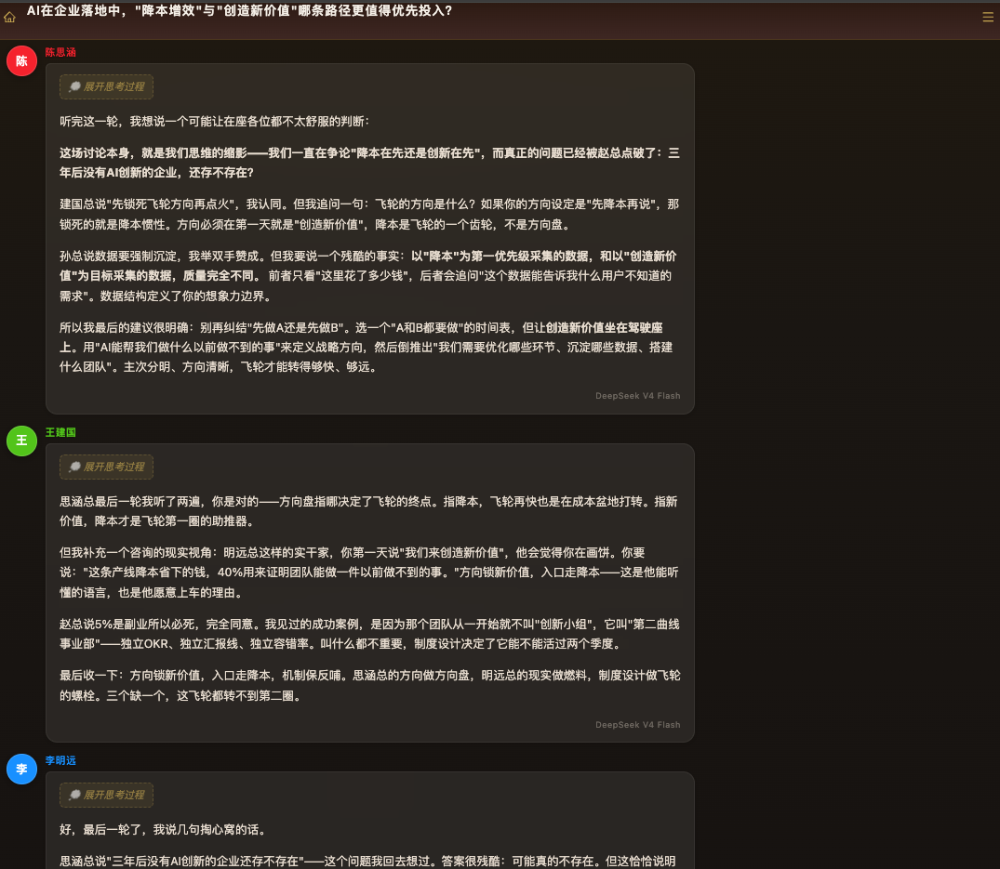
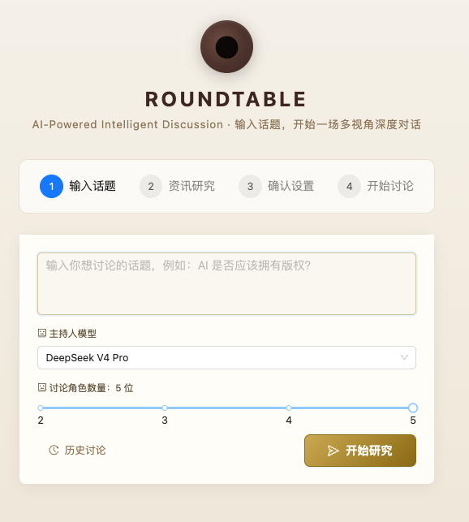

# 🏛️ Roundtable

> AI 驱动智能讨论 · 多视角深度对话

<p align="center">
  
</p>

Roundtable 是一款 AI 驱动的圆桌讨论应用。输入话题，AI 将以实时流式输出的方式主持一场多角色讨论——搜索资讯、生成多元视角的参与者、协调发言顺序、生成讨论总结。

---

## ✨ 功能特色

- **智能资讯研究** — AI 主持人自主判断是否需要网络搜索，提炼讨论问题
- **多角色生成** — 自动创建 2～5 位立场多元、背景各异的讨论参与者
- **实时流式输出** — 基于 SSE 的流式传输，实时展示发言、推理过程、思考内容
- **用户参与讨论** — 以真人身份加入讨论，举手发言
- **圆桌可视化** — 圆形桌面布局动画，发言者带有金色旋转光环
- **模型自由选择** — 可独立配置主持人模型和每位参与者的模型（200+ 模型可选）
- **讨论总结** — 讨论结束时自动总结，也可随时手动触发
- **深色主题** — 沉浸式会议室深色主题，金色点缀
- **响应式设计** — 适配手机屏幕
- **讨论历史** — 随时回看过往讨论

---

## 🛠 技术栈

| 层级 | 技术 |
|------|------|
| 前端 | React 18 · Vite 6 · Ant Design 5 · React Router 7 · react-markdown |
| 后端 | Hono · TypeScript · better-sqlite3 |
| AI | OpenCode API（SSE 流式） |
| 运行时 | Node.js / Bun |

---

## 📋 环境要求

- **Node.js** >= 18 或 **Bun**（推荐使用）
- 已启动的 **OpenCode 服务**（默认 `http://127.0.0.1:4096`）

---

## 🚀 快速开始

### 1. 安装依赖

```bash
bun install
cd server && bun install
cd ../frontend && bun install
cd ..
```

### 2. 配置环境变量

创建 `server/.env`：

```env
OPENCODE_BASE_URL=http://127.0.0.1:4096
OPENCODE_USERNAME=opencode
OPENCODE_PASSWORD=你的密码
PORT=3001
```

### 3. 启动开发环境

```bash
# 终端 1 — 后端服务（端口 3001）
cd server && bun run dev

# 终端 2 — 前端开发服务器（端口 5173）
cd frontend && bun run dev
```

浏览器访问 `http://localhost:5173`。

### 4. 生产环境构建

```bash
cd frontend && bun run build
cd ../server && bun run dev
```

访问 `http://localhost:3001`。

---

## 📂 项目结构

```
Roundtable/
├── server/                     # 后端
│   ├── src/
│   │   ├── index.ts            # Hono 应用入口，路由注册
│   │   ├── config.ts           # 环境变量配置
│   │   ├── routes/
│   │   │   ├── discussion.ts   # REST + SSE 接口
│   │   │   └── model.ts        # 模型列表 API
│   │   └── services/
│   │       ├── coordinator.ts  # 核心讨论逻辑
│   │       ├── db.ts           # SQLite 数据层
│   │       └── opencode.ts     # OpenCode API 客户端
│   └── data/                   # SQLite 数据库（自动创建）
├── frontend/                   # React 单页应用
│   ├── src/
│   │   ├── api.js              # API 客户端
│   │   ├── pages/
│   │   │   ├── CreatePage.jsx  # 话题输入与设置
│   │   │   ├── DiscussionPage.jsx  # 实时讨论页面
│   │   │   └── HistoryPage.jsx     # 讨论历史
│   │   └── components/
│   │       ├── RoundTable.jsx  # 圆桌可视化
│   │       └── ThinkingText.jsx    # Markdown + 思考渲染
│   └── dist/                   # 构建产物
└── pic/                        # 截图
```

---

## ⚙️ 环境变量

| 变量 | 默认值 | 说明 |
|------|--------|------|
| `OPENCODE_BASE_URL` | `http://127.0.0.1:4096` | OpenCode API 地址 |
| `OPENCODE_USERNAME` | `admin` | OpenCode 用户名 |
| `OPENCODE_PASSWORD` | — | OpenCode 密码（必填） |
| `PORT` | `3001` | 后端服务端口 |
| `DB_PATH` | `data/roundtable.db` | SQLite 数据库路径 |

---

## 🎯 使用流程

1. **输入话题** — 可以是技术辩论、时事热点等任意话题
2. **配置设置** — 选择角色数量（2～5）、发言次数、AI 模型
3. **资讯研究** — AI 自动搜索背景资讯，提炼讨论问题
4. **确认参与者** — 编辑角色、增减成员、选择是否亲自参与
5. **开始讨论** — 观看实时流式的圆桌讨论
6. **举手发言** — 作为真人用户举手参与讨论
7. **查看总结** — AI 自动生成结构化讨论总结

---

## 📸 截图

| 话题输入 | 讨论进行中 |
|:--------:|:----------:|
|  |  |

---

## 📄 许可证

MIT
